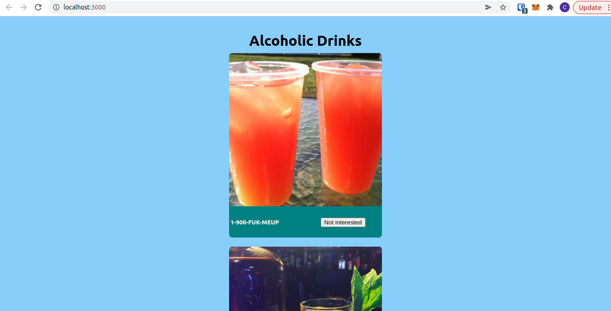
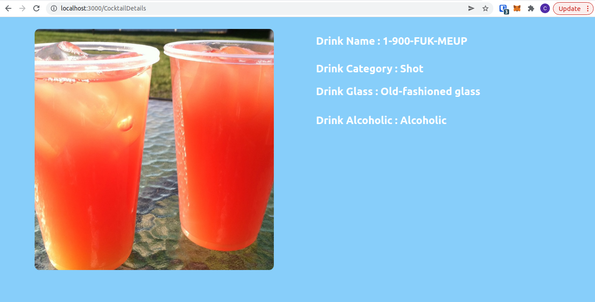

# This is the Cocktail Application built solely in React js with Raw css

This Application uses external Cocktail API. It will display list of Cocktail in scrollable way. Whenever we click on it. It display more information about the project.

## Set up the project

In the project directory, you can run:

### `npm install`

It will install all of the required dependencies

### `npm run start`
Application will start to run on port 3000

### `Screenshot of application`

